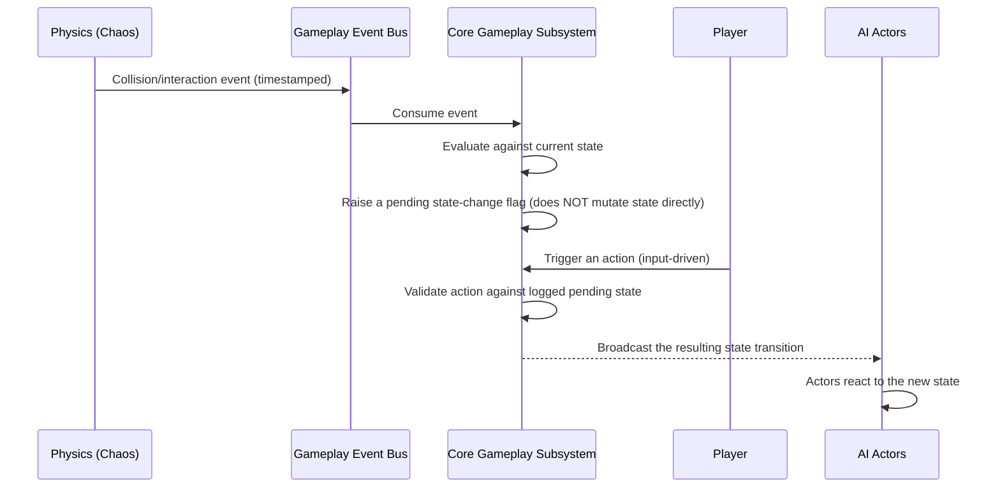

# Architecture

This document expands on the module map in [`.agent/AGENTS.md`](../.agent/AGENTS.md) §3. It describes the *structure*; `Docs/Adr/` records the *why* behind significant decisions.

## Module Map

```
Source/GameTemplate/
├── Core/              # Game mode, pawn/controller base classes, core game state
├── Physics/           # Physics Assets, custom Object Channels, collision matrix
├── AI/                # Behavior Trees, Utility AI, and/or simple controllers
├── Animation/         # (add when needed) Control Rig, IK, ragdoll blending
├── Audio/              # (add when needed) MetaSounds graphs
├── UI/                # (add when needed) HUD, menus
├── Network/           # (add when needed) replication/rollback
└── Tests/             # Automation Test specs
```

## Data Flow: A Generic Gameplay Event, End to End



## Why Gameplay Subsystems Hold State Instead of Acting Unilaterally

This is the most-referenced invariant in the codebase (`.agent/AGENTS.md` §6.3, §8; `.agent/rules/documentation.md`). A core gameplay/rules subsystem is intentionally an **observer with memory**, not an unconditional **actor** — it raises events other systems react to, rather than directly mutating state the instant a condition is met, *unless the design explicitly calls for immediate action*. This keeps the subsystem testable in isolation and auditable (every state change traces back to a timestamped event). Any refactor that has a rules subsystem silently bypass this event path is an architecture regression regardless of how correct its detection logic is.

## The AI Architecture (if hybrid Behavior Tree + Utility AI)

| Tier | Scope | Update cadence |
| --- | --- | --- |
| Global director (optional) | Whole-session posture (score/time/state-driven) | Low-frequency, event-driven |
| Behavior Trees | Per-actor tactical/structural constraints | Per-tick, but cheap (tree traversal, not physics) |
| Utility AI | Atomic action choice for the actor(s) that need it | Per-tick, but scoped to the active actor(s) |

This tiering exists to keep large-actor-count simulations affordable: only actors that need fine-grained Utility scoring run it, while others run cheap Behavior Tree tactical logic.

## Determinism Boundary

Anything captured by a replay buffer, or reconciled across networked clients, must be reproducible from a fixed seed. This applies to: physics impulse randomness, AI tie-breaking randomness, and gameplay-subsystem event timestamps. See `.agent/AGENTS.md` §8.3.

## Build & CI Topology

- **Local iteration**: `just build::editor` (Development config) via UnrealBuildTool, wrapping the standard `Build.sh`/`Build.bat` toolchain.
- **CI lint** (GitHub-hosted): clang-format + markdown link check — no engine install required.
- **CI build/test** (self-hosted, `ue5` label): requires a licensed Unreal Engine install; runs `just build::editor` + `just test::automation`.
- **Dedicated-server hosting** (`Infra/`): containerized Linux headless server target, deployed via Kubernetes/Helm, provisioned via Terraform/Ansible for anything outside the cluster. See `Infra/*/README.md`.

See `Moon/Roadmaps/architecture.md` for options considered on tooling/pipeline decisions, and `Docs/Adr/` for decisions already made.
