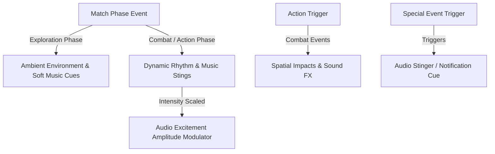

# Audio Design Document (ADD): [Project Name]
*[Acoustic Identity, Dynamic Audio Systems, and Spatial Combat Effects]*

---

## 1. Acoustic Identity & Design Philosophy

[Project Name] relies on a distinct acoustic landscape designed to balance peaceful/exploration phases with high-intensity combat or puzzle encounters.

---

## 2. Dynamic Audio Systems

The soundtrack and ambient environmental loops adjust dynamically using a centralized **Excitement Scale** ($E \in [0.0, 1.0]$) monitored by the game loop:
$$E = w_1 \cdot \text{EnemiesOnScreen} + w_2 \cdot \text{PlayerHealthLoss} + w_3 \cdot \text{BossPresence}$$

### 2.1 Phase / State Audio Transition Loops
*   **Low Intensity ($E < 0.2$)**: Smooth ambient sweeps, gentle background melodies, and environmental soundscapes.
*   **Medium Intensity ($0.2 \le E < 0.6$)**: Rhythmic pulse, elevated percussion, and building melodic tension.
*   **High Intensity ($E \ge 0.6$)**: Full orchestral/synth layers, aggressive driving beats, and prominent action cues.

---

## 3. Spatial Combat Audio

Sound effects are localized based on screen coordinates and spatial orientation to assist player situational awareness.

### 3.1 Weapon & Combat SFX Cues
1.  **Primary Ranged Attacks**: High-impact launch sounds with distance attenuation and attenuation tails.
2.  **Melee & Cleave Strikes**: Metallic or organic impact sounds synchronized with weapon animation contact frames.
3.  **Area-of-Effect Abilities**: Reverberant explosions or magic bursts with spatial decay.
4.  **Special Event Stingers**: Distinct audio notifications for key gameplay events or major boss entries.

---
*Document Version: 1.0*  
*Authoritative Reference: Docs/Design/game_design_document.md*
