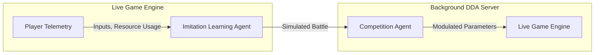

# Game Design Document (GDD): [Project Name]
*An In-Depth Blueprint for [Project Name]*

---

## 1. Executive Summary & Vision Statement

**[Project Name]** is a [Genre / High-Concept Summary] set in [Setting / Universe]. Players coordinate to defend objectives, manage resources, and engage in real-time strategic combat while developing long-term meta progress.

```
+--------------------------------------------------------------+
|                  CORE VALUE PROPOSITION                      |
+--------------------------------------------------------------+
|                                                              |
|   [Primary Gameplay Loop]    [Secondary Gameplay Loop]       |
|   - Real-time action         - Persistent progress           |
|   - Tactical combat          - Resource management           |
|                                                              |
+--------------------------------------------------------------+
```

### 1.1 The Gameplay Hybridization Imperative
To maximize long-term retention and engagement, [Project Name] utilizes a dual-loop framework:
*   **The Tactical Loop (Action/Strategy)**: A high-fidelity, real-time tactical screen governing units, structures, and pathing navigation.
*   **The Strategic Loop (Meta/Progress)**: A persistent meta-game where players manage resources, unlock technology trees, and coordinate faction-level territory or guild objectives.

### 1.2 Target Demographics & Motivations
*   **Primary Audience**: Mid-core strategy and action players seeking tactical depth without cognitive exhaustion.
*   **Player Motivations**: High hedonic motivation (visceral visual/audio feedback) and strong social connection (cooperative multiplayer and faction goals).

---

## 2. Thematic Direction & Aesthetics

### 2.1 Visual Art Style ([Style Name / Aesthetic Concept])
The visual identity of [Project Name] features [Art Style Overview, Color Palette Principles, Material Shading, and Key References].

### 2.2 Auditory Landscape
The audio design balances peaceful exploration and planning phases with intense combat encounters, utilizing dynamic music scaling and spatial sound attenuation.

---

## 3. Core Gameplay Loop & Mechanics

### 3.1 The Primary Gameplay Cycle
1.  **Preparation Phase**: Players place structures, organize units, and allocate resources.
2.  **Action / Wave Phase**: Real-time combat engagement against incoming wave surges or opponent forces.
3.  **Resolution Phase**: Reward distribution, base repair, and strategic meta updates.

### 3.2 Base Structures & Objectives
*   **Main HQ / Citadel**: Primary objective that must be defended. Loss results in match failure.
*   **Resource Outposts**: External structures generating tactical currency or energy.
*   **Defensive Towers / Fortifications**: Player-constructed chokepoints and static defenses.

### 3.3 Unit & Tower Classification
*   **Light Units**: High speed, low health, effective against specialized targets.
*   **Heavy Units**: Armored, high health, effective for chokepoint blocking.
*   **Ranged & Artillery**: High damage, long range, vulnerable to fast flankers.
*   **Support Units**: Healing, buffering, or aura generation.

### 3.4 Core Algorithmic Engines

#### Pathfinding Mathematical Architecture
Pathfinding for dynamic entities is calculated using vector gradient fields calculated over a cost grid $C(p)$:
$$C(p) = \min_{n \in \text{Neighbors}(p)} \left( C(n) + \text{Cost}(p \to n) \right)$$
Directional velocity vectors are pre-computed as $V(p) = -\nabla C(p)$, enabling $O(1)$ directional lookups for all entities.

---

## 4. Multiplayer Netcode & Cloud Orchestration

### 4.1 Serialization & Data Transport
State updates are serialized using dense binary buffers (e.g. FlatBuffers) and transmitted over UDP socket connections. Delta compression is applied to minimize network bandwidth usage.

### 4.2 Cloud Orchestration & Matchmaking
Player lobbies are assembled using latency-graduated matchmaking rulesets. Match servers run on scalable cloud instances to optimize hosting costs while maintaining strict latency targets (<50ms).

---

## 5. Algorithmic Procedural Content Generation (PCG)

```
+-------------------------------------------------------------+
|               PCG Environment Synthesis Pipeline            |
+-------------------------------------------------------------+
|                                                             |
|  [Wave Function Collapse] ---> [MILP Path Solver]           |
|  (Local Tile Adjacency)        (Global Map Solvability)     |
|                                        |                    |
|                                        v                    |
|                                [RL Map Decorator]           |
|                                (Tactical Placement)         |
+-------------------------------------------------------------+
```

### 5.1 Local Constraints: Wave Function Collapse (WFC)
Grid tiles are initialized in superposition and collapsed based on local tile adjacency rules and entropy minimization.

### 5.2 Global Constraints: MILP Solver
A Mixed Integer Linear Programming (MILP) solver validates the global layout to ensure guaranteed path connectivity between spawn points and primary objectives.

### 5.3 Strategic Optimization: RL Map Generation
Reinforcement Learning agents refine tile features to optimize strategic chokepoints, tower placement zones, and tactical depth.

---

## 6. AI-Driven Dynamic Difficulty Adjustment (DDA)



### 6.1 Two-Agent Neural Network Framework
*   **Imitation Agent**: Learns to replicate player behavior and skill level in real-time.
*   **Competition Agent**: Deploys dynamic counter-strategies against the Imitation Agent to calibrate match difficulty.

### 6.2 Continuous Parameter Modulation
Modulates game parameters (spawn rates, enemy attributes, resource drops) using reinforcement learning (PPO) to maintain optimal player engagement and physiological arousal.

---

## 7. LiveOps, Retention & Monetization

### 7.1 Offer Personalization: Contextual Multi-Armed Bandits (CMAB)

#### LinUCB Mathematical Formulation
Store offers are dynamically selected for user context vector $x_{t, a}$ by estimating expected conversion probability $p_{t, a}$:
$$p_{t, a} \equiv x_{t, a}^T \hat{\theta}_a + \alpha \sqrt{x_{t, a}^T A_a^{-1} x_{t, a}}$$

### 7.2 Early Churn Forecasting (Weibull Survival Analysis)
Time-to-churn is modeled parametrically using a Weibull survival distribution:
$$S(t | x) = \exp\left( -\left( \lambda(x) \cdot t \right)^\beta \right)$$

### 7.3 Community Stability: Temporal Graph Neural Networks (TGNN)
Social graphs are monitored to detect churn cascade risks and trigger targeted retention interventions for connected player groups.

---

## 8. Mathematical Optimization Methods

### 8.1 Genetic Algorithms (GA) for Defensive Layout Optimization
Layout generation uses evolutionary algorithms to optimize static obstacle placement against path length objective functions.

### 8.2 Ant Colony Optimization (ACO) for Strategic Supply Line Routing
Pheromone-based graph search algorithms calculate optimal logistics routes across dynamic map nodes, bypassing high-risk areas.

---

## 9. Codebase Analysis & Integration Roadmap

### 9.1 Current Codebase State
*   **Presentation / Native Shell**: Native UI views and game rendering viewports.
*   **Core Logic**: Simulation scripts, component definitions, and asset loaders.

### 9.2 Architectural Gaps
1.  **Simulation Parity**: Aligning physics and game logic calculations across target platforms.
2.  **Netcode Implementation**: Establishing real-time UDP serialization and state synchronization.
3.  **Shared Core Engine**: Integrating C++ simulation modules with native view shells.

### 9.3 Integration Roadmap

```
+-----------------------------------------------------------------------------------+
| Phase 1: Native Parity & Setup                                                    |
| - Standardize game-state machine states (Menu, Playing, Paused, GameOver).         |
| - Build shared levels asset JSON reading framework into both native modules.      |
+-----------------------------------------------------------------------------------+
                                          |
                                          v
+-----------------------------------------------------------------------------------+
| Phase 2: Core Simulation Engine                                                   |
| - Write core ECS simulation in C++.                                               |
| - Build interop bindings and binary serialization buffers.                        |
+-----------------------------------------------------------------------------------+
                                          |
                                          v
+-----------------------------------------------------------------------------------+
| Phase 3: Multiplayer Sync & Backend                                               |
| - Integrate UDP socket replication and delta compressed state syncs.               |
| - Deploy server fleets and matchmaking rulesets.                                  |
+-----------------------------------------------------------------------------------+
```

---
*Document Version: 1.0*  
*Authoritative Reference: Docs/Design/game_design_document.md*
