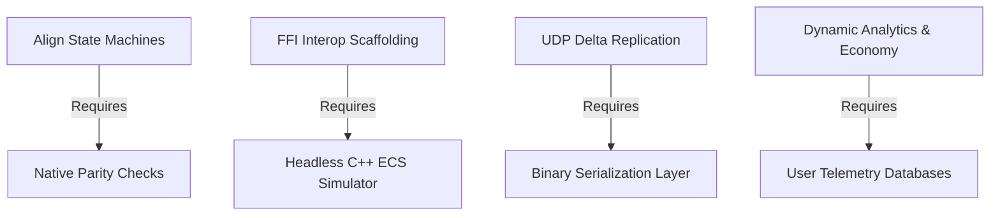

# Production Roadmap: [Project Name]
*Milestones, Sprint Pipelines, and Shared Technical Dependencies*

---

## 1. Project Milestones

The development schedule spans four core phases, progressing from platform architecture to advanced gameplay systems:

```
+-------------------------------------------------------------------------------+
| PHASE 1: Native Parity & Environment Setups (Weeks 1-4)                        |
| - Standardize game-state machine states across all client platforms.          |
| - Build shared level asset JSON loading framework.                            |
+-------------------------------------------------------------------------------+
                                       |
                                       v
+-------------------------------------------------------------------------------+
| PHASE 2: Core Simulation Engine (Weeks 5-8)                                   |
| - Implement core ECS / physics simulation engine in C++.                      |
| - Build interop bindings and binary state serialization buffers.              |
+-------------------------------------------------------------------------------+
                                       |
                                       v
+-------------------------------------------------------------------------------+
| PHASE 3: Multiplayer Networking & Backend Infrastructure (Weeks 9-12)         |
| - Implement network sockets and delta-compressed state syncs.                |
| - Provision cloud server fleet and configure matchmaking rulesets.            |
+-------------------------------------------------------------------------------+
                                       |
                                       v
+-------------------------------------------------------------------------------+
| PHASE 4: Optimization, AI & LiveOps Systems (Weeks 13-16)                    |
| - Integrate procedural content solvers and map generation pipelines.          |
| - Deploy dynamic difficulty adjustment loops and analytics telemetry.         |
+-------------------------------------------------------------------------------+
```

---

## 2. Sprint Allocations

| Sprint | Objective | Deliverables |
| :--- | :--- | :--- |
| **Sprint 1** | Native Alignment | Shared level JSON loading schemas, synchronized state machine loops. |
| **Sprint 2** | Core Simulation | C++ ECS simulation engine, FFI interop bindings, binary serialization. |
| **Sprint 3** | Multiplayer Sync | Sockets layer, delta compression vectors, cloud fleet matchmaking rulesets. |
| **Sprint 4** | Optimization & AI | Procedural content solvers, dynamic difficulty adjustment, store analytics. |

---

## 3. Critical Technical Dependencies



1.  **Core Simulation Integration depends on Native Alignment**:
    Before replacing native view loops with C++ core calls, all target platforms must execute identical state transitions.
2.  **Multiplayer Replication depends on Binary Serialization**:
    Delta-compression replication requires zero-copy or compact binary buffer output.
3.  **Procedural Generation Solvers depend on Tile Adjacency Schemas**:
    Constraint solvers cannot run until map tile boundaries have defined constraint weights.

---
*Document Version: 1.0*  
*Authoritative Reference: Docs/Design/game_design_document.md*
