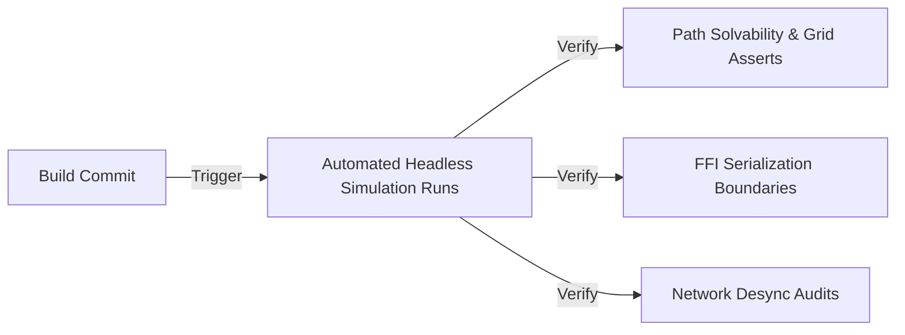

# QA Test Plan: [Project Name]
*Automated Simulation Runs, Replication Sync Checks, and On-Device Profiling Standards*

---

## 1. Quality Assurance Testing Methodologies

[Project Name] combines automated headless simulation passes with on-device rendering and integration validation.

### 1.1 Automated Headless Simulation Runs
*   **Headless Tests**: The game loop is run in a pure headless C++ test harness (e.g. GoogleTest), executing matches without rendering overhead.
*   **Stress Checks**: Simulates matches containing large entity counts (e.g. 500 simultaneous entities) to verify path recalculation speeds and detect CPU bottlenecks.

### 1.2 System Solvability Assertions
*   **Procedural Level Generator Asserts**:
    *   *Assert 01*: The pathfinder cost map must contain a valid, unblocked pathway from every active spawn gate to the target HQ / objective.
    *   *Assert 02*: Generated level layouts must not exceed placement and budget constraints.

---

## 2. Network Replication Synchronization

To maintain match integrity over variable network conditions, replication checks run continuously:

### 2.1 Emulated Latency Profiles
*   **Profile 1 (Typical Cellular)**: Latency: 60ms, Packet Loss: 0.5%, Jitter: 5ms.
*   **Profile 2 (Lossy Cellular)**: Latency: 100ms, Packet Loss: 3.0%, Jitter: 12ms.
*   **Profile 3 (High Jitter / Transit)**: Latency: 150ms, Packet Loss: 7.0%, Jitter: 25ms.

### 2.2 Desynchronization Audits
*   The Dedicated Server monitors client position predictions. If coordinate discrepancies exceed a threshold (e.g. $0.5\text{ units}$) due to dropped packets, a reconciliation snap is executed during wave breaks to prevent visual jitter during active gameplay.

---

## 3. On-Device Profiling Standards

To preserve thermal limits and prevent battery drain across all target hardware platforms:

### 3.1 Memory Allocation Targets
*   **Android Allocation Targets**: Heap memory allocations must remain under $120\text{MB}$. Per-frame allocations inside the main loop thread must be $0$ to prevent Garbage Collection pauses.
*   **iOS / Native Allocation Targets**: Active allocations must remain under $100\text{MB}$. Reference counts are audited to prevent cyclic memory leaks across FFI borders.

### 3.2 Thread Budget Allocations
*   *Game Loop Update Tick*: $\le 3.0\text{ms}$
*   *Core Simulation FFI Update*: $\le 4.0\text{ms}$
*   *Native Presentation Rendering*: $\le 8.0\text{ms}$

---
*Document Version: 1.0*  
*Authoritative Reference: Docs/Design/game_design_document.md*
