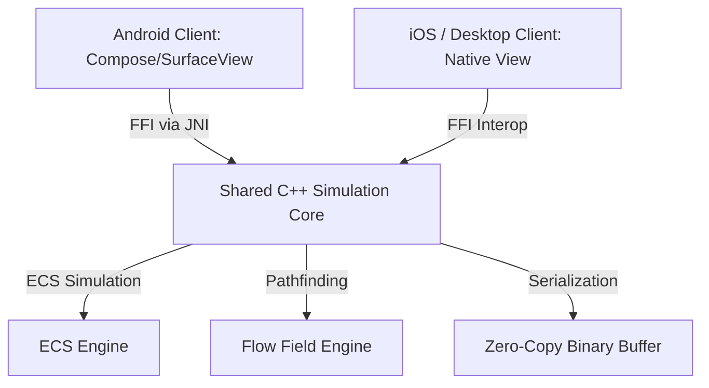

# Technical Design Document (TDD): [Project Name]
*Core Architecture, FFI Interop Bindings, Binary Serialization, and Pathfinding Systems*

---

## 1. System Architecture

[Project Name] uses a cross-platform architectural model: presentation layers remain native for maximum UX fidelity, while game simulation, pathfinding, and core logic are unified in a headless C++ core.

### 1.1 Core Components
1.  **Shared C++ Simulation Core (`core/`)**:
    *   Written in standard C++20, exposing a clean C ABI shim.
    *   Implements the Entity-Component-System (ECS) pattern.
    *   Governs all game state modifications, wave progress, collision tracking, and path updates.
2.  **FFI Interop Bindings**:
    *   Android calls into the core through JNI wrappers over the C ABI shim.
    *   iOS / Native clients call into the core through C++ interoperability wrappers.
    *   Enables low-latency cross-boundary function calls and callbacks.
3.  **Zero-Copy Serialization (FlatBuffers)**:
    *   Encodes state changes into dense binary byte arrays.
    *   Clients traverse the binary buffer without memory allocation, eliminating parsing overhead.

---

## 2. Dynamic Flow-Field Pathfinding

To navigate dynamic entities efficiently on mobile/desktop CPU threads, the C++ core runs a vector gradient pathfinder:

### 2.1 Dijkstra Cost Map
*   Terrain tiles are mapped to costs: open path ($1.0$), difficult terrain ($2.5$), blockage ($\infty$).
*   Dijkstra's algorithm propagates costs outward from the objective target ($C(T) = 0$):
    $$C(p) = \min_{n \in \text{Neighbors}(p)} \left( C(n) + \text{Cost}(p \to n) \right)$$

### 2.2 Gradient Vector Field
*   For each grid cell, a normalized directional vector pointing to the neighbor with minimum cost is pre-calculated:
    $$V(p) = -\nabla C(p)$$
*   Entities determine their velocity vector by indexing their grid coordinate, reducing path lookup from $O(N^2)$ to $O(1)$.

---

## 3. Network Synchronization & Backend Infrastructure

[Project Name] features a **Server-Authoritative State Synchronization** model:

### 3.1 Session Matchmaking
*   Matchmaking services group players based on latency telemetry. Lobbies prioritize low latency (<50ms) before relaxing restrictions during low concurrency hours.

### 3.2 Server Fleet & Instance Management
*   Cloud server fleets utilize auto-scaling spot instances to minimize operational costs.
*   Upon instance termination events, matchmaking queues divert new sessions to backup fleets and provide active matches a grace window for state migration.

---
*Document Version: 1.0*  
*Authoritative Reference: Docs/Design/game_design_document.md*
